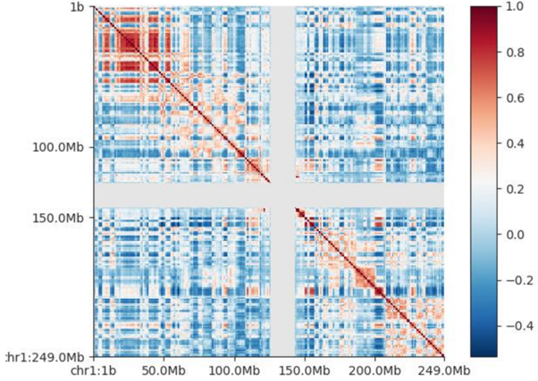
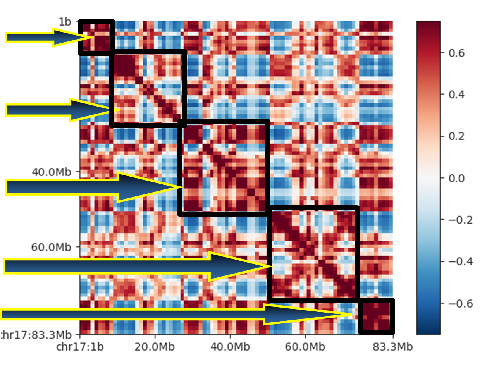
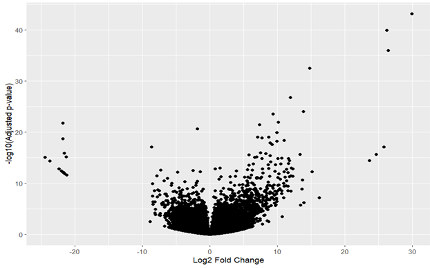
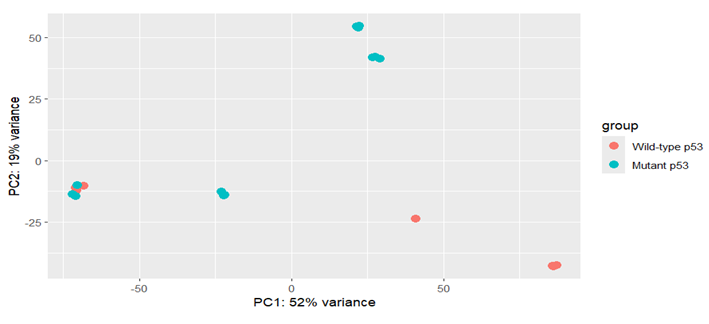
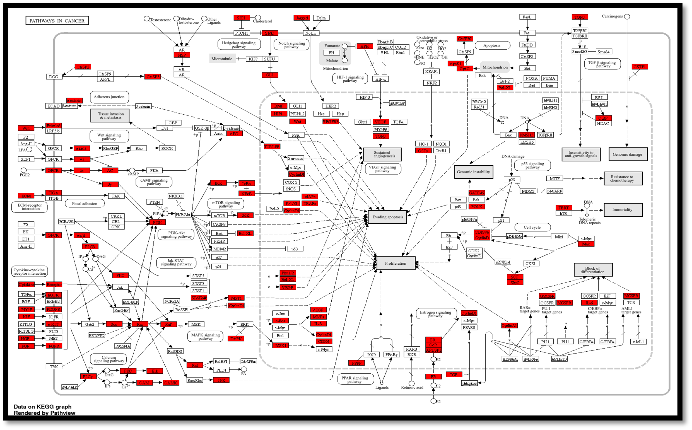

# ChromatinDynamicsCancer

## Overview
The primary objective of this project was to analyze ChIP-seq and HiC data from p53 and mutant p53-specific control cell lines to identify unique genes and pathways regulated by these proteins. This research aimed to elucidate the roles of p53 and mutant p53 in tumor suppression and cancer progression and to understand how differential chromatin regulation influences oncogenic and tumor-suppressor gene activation or inactivation.

## Tools used - 
* fastqc
* cutadapt
* bowtie2
* MACS2
* bedtools
* ChIPseeker
* FAN-C
* Enrichr
* ShinyGO
* PANTHER

## ChIP-Seq
Chromatin immunoprecipitation (ChIP) is an experimental method to study protein-DNA interactions. By integrating chromatin immunoprecipitation (ChIP) assays with sequencing techniques, ChIP sequencing (ChIP-Seq) represents a potent approach for identifying DNA binding sites of transcription factors and other proteins across the entire genome.

### Data 
Sequence reads obtained from the GEO database [https://www.ncbi.nlm.nih.gov/geo/](https://www.ncbi.nlm.nih.gov/geo/) were retrieved by utilizing their corresponding accession IDs to download the data from ENA [https://www.ebi.ac.uk/ena/browser/home](https://www.ebi.ac.uk/ena/browser/home) in FastQ format for p53 and mut p53 specific cell lines.

### Quality Control
The quality assessment of all sequenced reads was performed using FASTQC version 0.11.3. Subsequently, based on the quality report, poor quality reads having contaminating adapter sequences were subjected to trimming using cutAdapt version 1.12. 
```
Cutadapt –a <Adapter_sequence> -o <output_filename> <input_filename>
```
### Read Mapping
The filtered reads were mapped to the reference genome (hg38 Built) downloaded from UCSC Browser using Bowtie2 v2.2.6. Bowtie2 gives alignment output in .sam format. The indexed file for the reference genome GRCh38 was obtained from [https://www.ebi.ac.uk/ena/browser/home](https://genome-idx.s3.amazonaws.com/bt/GRCh38_noalt_as.zip)
For unpaired reads:
```
bowtie –x <Index_name> -U <Input_filename> -S <Output_filename.sam>
```

For paired reads:
```
bowtie2 –x <Index_name> -1 Read1.fastq -2 Read2.fastq –S <output_filename.sam>
```

The resultant SAM file which store reads aligned to a reference genome was converted to its indexed , block-compressed binary format, BAM that provides fast, direct access to any part of the file, using SAMtools v1.7.
```
samtools view –bS <input_filename.sam> -o <Output_filename.bam>
```
The resultant BAM files were sorted by coordinates using “sort” option with the command.
```
samtools sort <input_filename.bam> > <output_sort.bam>
```

### Peak Calling
This step intended to find the genomic regions that indicate binding sites of p53 and mut p53. To identify regions exhibiting notable enrichment of ChIP signals in comparison to the background (DNA input or mock IgG samples), peak calling was performed on the sequencing reads aligned to the genome using Model-based Analysis for ChIP-Seq (MACS2), version 2.1.1.
```
macs2 callpeak –t <Treated_sample.bam> -c <input_sample.bam> -f BAM –n File_name_output
```
Following this procedure, a BED file containing the chromosome name, peak start position, and peak end position is obtained.

### Creating a non-redundant data set
For this first all the BED files were sorted by chromosome and then by Start position in ascending order using “sort” option of BedTools.
```
bedtools sort –i <Input_filename.bed> > sorted.bed
```
After sorting all the BED files, non-redundant data set for p53 and mut p53 were created using “bedtools merge” which merge overlapping repetitive elements into a single entry.
```
bedtools merge –i <names of all BED files> > merged.bed
```

### Peak Annotation
The annotation process aimed to associate biological significance and contextual relevance to the identified features. An R package called [ChIPseeker](https://bioconductor.org/packages/release/bioc/vignettes/ChIPseeker/inst/doc/ChIPseeker.html) was used to annotate the peaks that took input in the form of 3 columns BED file.

### Functional Analysis
Functional enrichment analysis of the gene set that are uniquely regulated by p53 and mut p53 was done using [Enrichr](https://maayanlab.cloud/Enrichr/) to identify key pathways and ontologies associated with the gene set. The nucleotide sequences corresponding to the peak coordinates were downloaded from the UCSC genome browser (Kent, Sugnet et al. 2002) using an in-house perl script and was used as an input to MEME-ChIP to identify consensus binding sequence or motif sequence in peak region.

## HiC Data Analysis
The Hi-C method identifies physical proximity between pairs of chromosomal loci in an unbiased manner on a genomic scale, without relying on binding to any specific protein or immunoprecipitation. FANC (v.0.9.26b): a feature-rich framework for the analysis and visualisation of chromosome conformation capture data tool was used for this purpose

### Generating FAN-C pairs
```
fanc pairs R1.bam R2.bam output.pairs –r HindIII –g GRCh38.p13.genome.fa

-g: Path to genome file (FASTA, folder with FASTA, HDF5 file), which will be used in conjunction with the type of restriction enzyme to calculate fragments directly. Here, FASTA file of Hg38 assembly was downloaded from GENCODE.
-r: Name of the restriction enzyme used in the experiment, e.g. HindIII
```

### Generating HiC Objects
```
fanc hic <output.pairs> output.hic –b 1mb

-b : Bin size in base pairs. Human-readable formats, such as 10k, or 1mb. If omitted, the command will end after the merging step.
```

### Analysing HiC Matrices
Regions in a Hi-C matrix can generally be assigned to either the active or the inactive compartment, also called ‘A’ and ‘B’ compartments, respectively. Compartments are derived from a correlation matrix, in which each entry i, j corresponds to the Pearson correlation between row i and column j of the (Hi-C) matrix (.hic file generated in the previous step). The eigenvector of the correlation matrix is used to derive compartment type and strength for each matrix bin. Generally, regions with positive values are assigned the ‘A’, regions with negative values the ‘B’ compartment.
```
fanc compartments output.hic output.ab –g GRCh38.p13.genome.fa

Input: hic object file
Output: AB compartment matrix file
Eigen vectors are calculated which is used to assign the genome bins into A or B compartments
-g : Genome file. Used to “orient” the eigenvector values (change sign) using the average GC content of domains. Possible input files are FASTA, folder with FASTA, commaseparated list of FASTA used to change sign of eigenvector based on GC content.
```
### Plotting AB Compartments for visualization
```
fancplot -o plot.png chr<n> \-p square output.ab \-vmin -0.75 -vmax 0.75 -c RdBu_r
```


## DeSeq2
DESeq2 is a R package designed for differential gene expression analysis based on the negative binomial distribution. It estimates the gene-wise dispersions (variance) and uses empirical Bayes technique to shrink these estimates. It fits a negative binomial model to the counts, which allows for greater variability than expected under a Poisson process.

For DESeq2 analysis, we had total 8 samples from wt p53 and 12 samples from mut p53 (including replicates), the condition set was such that, all the wild-type samples were compared against all the mutant samples as it can handle complex experimental designs.

## Results

### p53 mutation causes changes in chromatin topology and function
Upon visual inspection and subsequent analysis of the generated plots, an observable dif-ference in the chromatin structural organization was observed between the wild-type and p53 mutant samples. This observed difference was represented as a heatmap, with each bin corresponding to 1 Mb of genomic size. This process was carried out for all 22 autosomes and the sex chromosomes (X and Y), and a contact map for AB enrichment was plotted for visual analysis of the differential chromatin organization. About ~30% change in the Genome-Wide Active-Inactive topology between the wild-type and mutant condition was observed. Presented here is a heatmap for Chromosome 17 in both the wild-type and mutant conditions. The rationale behind the selection of Chromosome 17 for display is twofold: the impracticality of presenting plots for all chromosomes, and the relevance of Chromo-some 17 due to the location of the TP53 gene on this chromosome.



In our investigation, we identified a set of ‘Compartment switching genes.’ These genes exhibit dynamic behaviour, transitioning between distinct compartments. Specifically:
*Genes shift from active topologies in wild-type phenotype to inactive topologies in the mutant phenotype
*Conversely, other genes move from the inactive topologies in wild-type phenotype to active topologies in mutant phenotype.

### Variation in Genes expression in mutant p53 as compared with the wild-type samples 
Utilizing RNA-seq data, we discerned differentially expressed genes in both wild-type and mutant p53 conditions. These alterations reflect differential gene expression across the entire transcriptome, rather than being solely attributed to conformational changes in chromatin. To visualize these differential gene expression patterns, we generated plots for enhanced clarity.



Each individual dots represent a gene deviating from the log2fold change value of 0, i.e no change in gene expression. From this plot we can see that some genes have high negative log2fold change values (<-20) which are about 15 in number whereas there are also 6 genes which have a very high positive values of log2fold change indicating >20-fold upregulation of these genes in the mut p53 samples.

### PCA
Furthermore, we also did the principal component analysis to plot the variances within our samples. We expected high variance from the sample because we intentionally took different cell lines to account for cell-line specific changes and to minimize that. We wanted to make sure that the changes in the expression that we are seeing here are not because of the cell line specific variations within the cancer cells.



From the RNA-seq data analysis we identified a total of 2769 genes that were getting downregulated in mut p53 with a (cutoff -1), as compared to wt p53. Total upregulated genes (cutoff +1) in mut p53 with respect to the wt sample were 2647 genes.

### Connecting the link between conformation change and gene expression regulation
With our hic data analysis we got 2 different sets of “Compartment Switching Genes”. These gene list contained 5758 and 5343 genes respectively. Functional annotation and pathway enrichment was done for these gene sets using Enrichr , PANTHER and ShinyGO

We used ShinyGO to annotate the role of compartment switching genes from inactive topologies to active topologies in mutant p53 phenotype in pathways related to cancer. 


Pathway enrichment analysis and GO top hit corresponds to Apoptosis signalling pathway which is an indicative of roles of these genes in cell death mediation, thereby giving more confidence to our hypothesis that mutation in p53 affects the 3D chromatin organisation which in turn affects various gene functioning and indeed helps in cancer progression.

## References
[^1]: Kruse, K., Hug, C.B. & Vaquerizas, J.M. FAN-C: a feature-rich framework for the analysis and visualisation of chromosome conformation capture data. Genome Biol 21, 303 (2020). https://doi.org/10.1186/s13059-020-02215-9
[^2]: fastQC (v0.12.0): [https://www.bioinformatics.babraham.ac.uk/projects/fastqc/](https://www.bioinformatics.babraham.ac.uk/projects/fastqc/)
[^3]: Cutadapt (v1.12): [10.14806/ej.17.1.200](10.14806/ej.17.1.200)
[^4]: Bowtie2 (v2.5.2): Langmead B, Salzberg S. Fast gapped-read alignment with Bow-tie 2. Nature Methods. 2012, 9:357-359.
[^5]: DESeq2: doi:10.18129/B9.bioc.DESeq2


